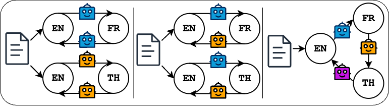

# LLM as a Broken Telephone: Iterative Generation Distorts Information



This repository contains the code and data accompanying the research paper "LLM as a Broken Telephone: Iterative Generation Distorts Information".  We investigate how Large Language Models (LLMs) distort information when used iteratively for tasks like translation and rephrasing, mirroring the "broken telephone" game where messages degrade through repeated transmission.

## Project Overview

The project explores the hypothesis that LLMs, when repeatedly processing their own output, introduce and accumulate errors, leading to a gradual divergence from the original input's meaning and factual accuracy.  We simulate this "broken telephone" effect using machine translation chains of varying complexities and rephrasing tasks.  We quantify this distortion using a combination of textual relevance metrics (BLEU, ROUGE, CHR-F, METEOR, BERTScore) and factuality assessment (FActScore).

## Repository Structure

The repository is organized as follows:
*   **`Datasets/`**: Contains the dataset used for the experiments and knowledge sources for FActScore.
*   **`Results/`**:  This directory stores the experimental results, inference outputs, and visualizations.
*   **`Scripts/`**: Contains the Python scripts for running the experiments, evaluating the results, and generating visualizations.
*   **`requirements.txt`**:  Lists the Python packages required to run the code.
## Getting Started

1.  **Clone the repository:**

    ```bash
    git clone <repository_url>
    cd LLM-as-a-Broken-Telephone
    ```
    

2.  **Install dependencies:**

    ```bash
    pip install -r requirements.txt
    ```
    

    You may need to install PyTorch separately, depending on your CUDA version.  See the PyTorch website for instructions: [https://pytorch.org/get-started/locally/](https://pytorch.org/get-started/locally/)

3.  **Data:** The `Datasets` directory contains the `all_data.csv` file. You'll need to select subsets of these for the different experiments, as described in the paper.

4. **Models:** The code is designed to work with Hugging Face Transformers models.  You'll need to have the models (Llama-3.1-8B-Instruct, Mistral-7B-Instruct-v0.2, Gemma-2-9B-it) available locally or accessible via the Hugging Face Hub. Ensure your HuggingFace API key is set and that you have access to the models.

## Running the Experiments

The core experiments are implemented in the `Scripts/` directory.  Each experiment type (Bilingual Self-loop, Bilingual Two-player, Multilingual Multiplayer, and the Ablations) has its own subdirectory with a `translate.py` script and a `config.py` file.

**General workflow:**

1.  **Configure `config.py`:**  Modify the `config.py` file within the relevant experiment directory to specify the desired settings:
    *   Ensure to set the desired `num_translations`.
    *   Set the `default_file_path` to the path of the file containing the data to use for the experiment.
    *   Set the `hf_auth_token` to your HuggingFace API key.

2.  **Run `translate.py`:** Execute the `translate.py` script to perform the iterative generation.

3.  **Evaluate results:**  Use the scripts in `Scripts/Evaluation/full_eval/` to compute the evaluation metrics (BLEU, ROUGE, CHR-F, METEOR, BERTScore, FActScore).

4.  **Visualize results:**  Use the scripts in `Scripts/Visualization/` to create plots similar to those in the paper.

## Examples to Run the Code

**1. Bilingual Self-loop (Llama-3 on news2024, English to French and back):**

```bash
cd Scripts/Bilingual-selfloop/Translation
python translate.py --model_name "meta-llama/Llama-3.1-8B-Instruct" --dataset_name "news2024" --cuda_device 0 --language_sequence en fr en --no-shuffle --default_file_path "all_data.csv"
```

**2. Bilingual Two-player (Llama-3 and Mistral on booksum, English to French and back):**

```bash
cd Scripts/Bilingual-twoplayer/Translation
python translate.py --model_name "meta-llama/Llama-3.1-8B-Instruct" "mistralai/Mistral-7B-Instruct-v0.2" --dataset_name "booksum" --language_sequence en fr en --no-shuffle --default_file_path "all_data.csv"
```

**3. Multilingual Multiplayer (Llama-3, Mistral, and Gemma on scriptbase, from English to French, German, Thai, and Chinese and back to English):**

```bash
cd Scripts/Multilingual-multiplayer/Translation
python translate.py --model_names "meta-llama/Llama-3.1-8B-Instruct" "mistralai/Mistral-7B-Instruct-v0.2" "google/gemma-2-9b-it" --dataset_name "scriptbase" --language_sequence fr de th zh --shuffle --default_file_path "all_data.csv"
```
note that in the multilingual multiplayer experiment, each translation chain starts with English and ends with English, and the bridge languages are being shuffled from an iteration to the other.